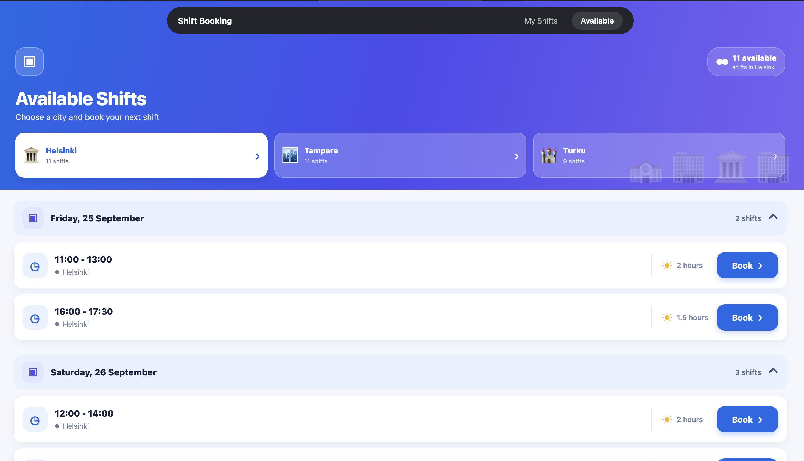
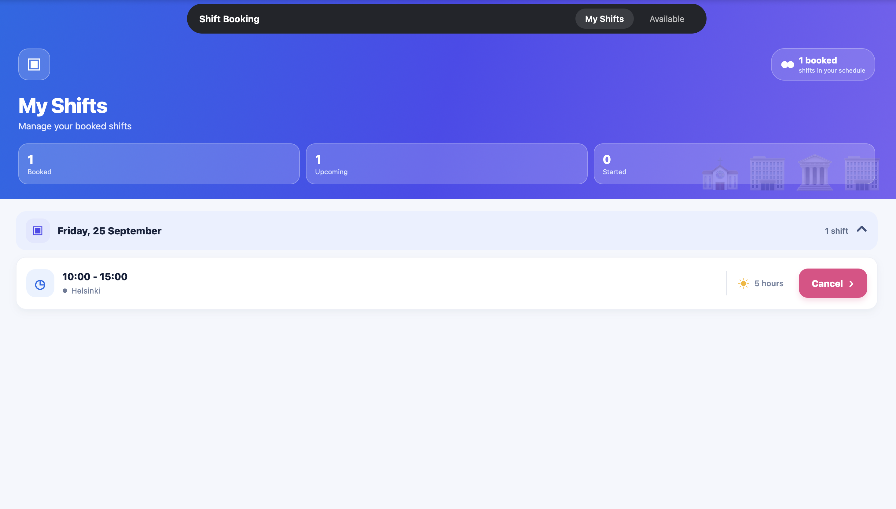

# 📱 Shift Booking

A React Native shift management application that allows users to browse, book, and manage available work shifts.

## 📸 Screenshots

### Available Shifts

Users can browse available shifts by city, view shifts grouped by date, and book suitable shifts.



### My Shifts

Users can view their booked shifts, upcoming shifts, and cancel eligible bookings.



## ✨ Features

- 🏙️ City-based shift filtering — Helsinki, Tampere, and Turku
- 📅 Date-wise shift grouping
- 📋 View available and booked shifts
- ✅ Book available shifts
- ❌ Cancel eligible booked shifts
- 🚫 Overlap prevention
- ⏰ Started-shift protection
- 🔌 Mock API integration
- ⏳ Loading and error states
- 📱 React Native / Expo based UI

## 🛠️ Technologies Used

- React Native
- Expo
- TypeScript
- Node.js
- HTTP Mock API
- Git & GitHub

## 📂 Project Structure

```text
shift-booking/
├── shift-booking/           # React Native application
├── react-native-assignment/ # Mock API
└── screenshots/             # Application screenshots